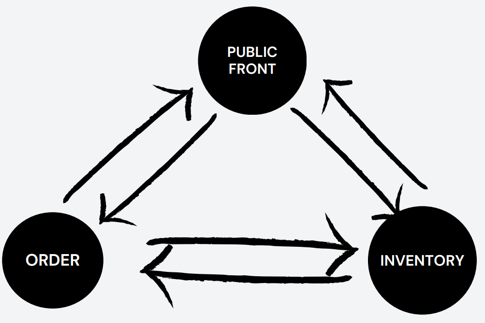
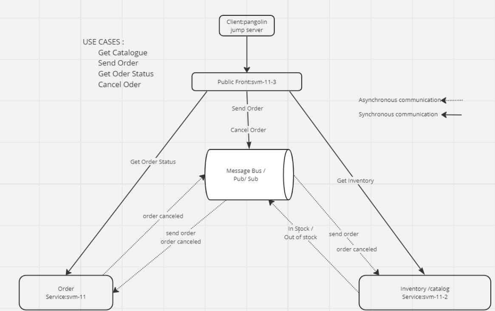

##  The project’s goal and the design principles

One of the requirements for the project was to have at least three nodes that exchange information between each other via messaging. Also, the system's global state shall be distributed to different nodes.

**Figure 1** The system consists of 3 nodes: public front, inventory, and order. Each node exchanges information with each other synchronously and asynchronously.

Webshop implementation consists of three services. Each service plays its own role in the system. All services interoperate with each other via synchronous and asynchronous messaging. Synchronous messages are idempotent and simply read data from other services. Asynchronous messages are not idempotent and cause state change in the system.

The system's global state is persisted in the databases of the Inventory and the Order services. Because the global state is in continuous transition, the state is also distributed to clients, and partly, the state is in an intermediate state when messages are still on the wire.

### Services and roles

**Front service**

The Public Front role is to hide underlying services from client applications. The service is stateless and only routes messages from clients to services directly or via the message bus.

**Backend services**

The Inventory service keeps track of product properties, prices, and availabilities in the inventory. Additionally, it also keeps track of reserved products for the orders. The Order service keeps track of orders and their statuses. Both services are stateless, but they store information to own databases.

### Use cases

The **Figure 2** describes in more detail the different use cases supported by the system. The use cases 'Get Catalog' and 'Get Order' are idempotent and are executed synchronously. The 'Send Order' and 'Cancel Order' use cases change the system state. Messaging between nodes is defined in **Figure 2**. All interactions between nodes are initiated when a client executes one of the use cases. 

**Idempotent use cases**

When the client executes the use case 'Get Inventory', it calls the Public Front service, which then routes the request to the Inventory service. The 'Get Order Status' call also first goes to the Public Front service, which then routes the request to the Order service. 

**Non-idempotent use cases**

The 'Send Order' and 'Cancel Order' use cases also go through the Public Front service, but the Public Front routes the message to the Message Bus and returns the response to the client.

In the case of the 'Send Order' use case, both the Inventory and the Order services subscribe to the 'Send Order' topic defined by the Public Front. The Order service simply initializes the order in its own database and sets the order state as 'undefined.' Simultaneously, the Inventory service processes the given order and attempts to deduct ordered products from the inventory. If all the ordered products are found in the inventory, the Inventory service publishes the message 'In-Stock' to the message bus. The Order service subscribes to the 'In-Stock' topic defined by the Inventory and updates the order state as 'successful.'

The 'Cancel Order' use case works in a similar way as 'Send Order', but only the Order service subscribes to the 'Cancel Order' message published by the Public Front. After the Order service has processed the cancellation routines, the Order service publishes the message 'Order Canceled.' The Inventory service subscribes to these messages and returns the reserved products for the order back to the inventory.

Because messaging between the client and backend services is asynchronous, the client should poll the order status to get confirmation about operation result.
 

**Figure 2** System architecture, use cases, and interoperation between nodes synchronously or asynchronously. Solid arrows represent synchronous message exchanges, and dashed arrows represent asynchronous. The figure also has defined server names used in the system demonstration.

### Syncronous messaging 

Between the client and Public Front, all messages can be considered to be synchronous, even though the client can utilize asynchronicity by executing calls in a different thread. Another way to say this is that the client will expect to receive some kind of response from the Public Front. 

The Public Front exposes services over the HTTP protocol, and response message headers always contain an HTTP response code that the client can use to identify either success or failure. If the request fails, the client can send the request again until the request is successful. This is one of the consensus agreements between the client and the system. This also applies to synchronous messaging between the Public Front and backend services when the Public Front impersonates the client and makes calls to the back-end service on behalf of the original client.

### Asyncronous messaging 

The Public Front acts as a facade on top of the system. It is the top layer in the system and the only layer exposed outside. Communication with the Public Front is synchronous in nature, but communication inside the system is partly asynchronous.

Asynchronicity is implemented by using a middleware system called the Message Bus. The Message Bus's responsibility is to provide a reliable messaging channel between nodes. The Message Bus does not contain any domain logic.

The Message Bus use the MQTT protocol, and the protocol provides three different QoS levels for message deliveries. The 0-level does not guarantee that the message is received by the Message Bus. The 1-level guarantees that the message is received by the Message Bus at least once. The 2-level guarantees message delivery only once. As the level of QoS increases, the performance of messaging decreases.

Our system use 1-Level QoS in messaging. All published messages will receive acknowledgment from the Message Bus, indicating that the Message Bus has received the message. If the Message Bus does not send acknowledgment to the sender, the sender will resend the message until it receives acknowledgment from the Message Bus. This could lead to multiple copies of messages in the case that the Message Bus has received the message, but the acknowledgment has been lost. Therefore, all system subsystems that are subscribing to messages should handle the situation when the same message is received more than once. This is one of the consensus agreements between different nodes.

### Shared distributed state

The system state is distributed between nodes in two different ways. Backend services Inventory and Order persist the state of the inventory, reservations, and the orders. This makes the services stateful even though the services themselves are stateless. However, Public Front is fully stateless but uses backend services to build the state of the inventory and orders on demand. We could build a caching mechanism into the Public Front, and it could make sense. Also, we could build the Public Front so that it subscribes to events from the Message Bus when the order submission process is finished and notifies the client via a WebSocket channel. This would make the Public Front have state, but it would also add more complexity, for example from a recovery perspective.

## Functionalities

### Synchronization and consistency

Synchronization and consistency are built into the application and system design. The client will eventually be consistent with the rest of the system by polling the system status. Backend services will be consistent eventually. Because in the backend, messages are passed between services asynchronously via the message bus, the messages could be delivered in the incorrect order.

**Unordered events handling**

Because the Message Bus cannot guarantee message delivery order, the messages can be delivered in the incorrect order to backend services. This will lead to conflicts that should be resolved automatically. One example of such a conflict is when the Inventory publishes a message 'in-stock,' and the Order service starts to handle the message before the order is found in the Order service database. These situations are solved automatically by retry action because, in most cases, it could be assumed that the order-sent message will arrive in a few milliseconds.

### Naming and node discovery

The Public Front is the only service visible to clients. The Public Front will have its own address, which is found in the DNS system. In case the Public Front is scaled horizontally, the load balancer or reverse proxy has knowledge about the unique IP addresses of the Public Front nodes, and the client still only needs a single address.

Because the Public Front needs to know the addresses of the Inventory and the Order services, the addresses of those services are configured in the Public Front configuration. Address translation to IP addresses is done by DNS. If backend services are scaled horizontally, then a load balancer is needed between the Public Front and the backend services. Then all the Public Front instances will be configured to call the load balancer instead of directly calling backend services.

The Message Bus used in this project is a cloud service, and we assume it has elastic scalability. However, our system, as a client, can rely on a single address. This address is configured in each service's configuration file. The Inventory and the Order services do not need to know each other's addresses because all messages between them go through the Message Bus.

### Fault tolerance and recovery

Because the Public Front and backend services are stateless, they support elastic scalability and, therefore, provide high availability in case of traffic increases and server failures.

The prototype database engine is SQLite, which might not be suitable for production use. For production use, existing commercial database engines that provide the necessary fault tolerance to the system should be considered.

Service recovery is as simple as booting up a new server, installing the service, and starting the service. This is possible because services are stateless, and there is no need to rebuild state.

Fault tolerance and recovery still need a system that monitors each service and reacts to server or service failures. The same system can also control elasticity by starting and shutting down the services. Monitoring can be done using for example heart beats to check each service health. In our prototype, we did not implement such a system.

### Scalability

In ensuring the scalability of our system, we prioritize key architectural elements. The Public Front and backend services embody statelessness, a deliberate design choice that facilitates horizontal scaling as needed. Although the backend databases differ by maintaining state, we can ensure scalability through replication. Maintaining the consistency of those replicas can be done synchronously, meaning that changes are committed to all replicas before confirming the transaction.

To further optimize system performance, caching mechanisms will be strategically employed, focusing on storing frequently accessed data in memory particularly beneficial for optimizing the reading of the catalog.

The scalability of our Mosquitto message queue broker can be done using its bridge capability, which allows replication of messages across multiple brokers. With bridges between these brokers, messages can be duplicated seamlessly, forming a connected network. Then this network of linked brokers will collaboratively manage and distribute the flow of messages to ensure efficient communication.

### Perfomance

The scalability measures implemented in our system have a direct impact on its performance it is the basis for increasing system performance.

Horizontal Scaling: By enabling horizontal scaling through stateless front and backend services, the system can handle increased user load and traffic, leading to improved performance. Also the servers can be added to distribute the workload, resulting in faster response times and minimal downtime.

Database Replication: Replicating databases helps ensure data availability and reliability. It allows for load distribution and fault tolerance, which  will impact performance. Users can access data from the nearest replica, reducing latency and improving response times.

Caching Mechanisms: Implementing caching mechanisms can significantly enhance performance by storing frequently accessed data in memory. This reduces the need for repeated processing and database queries, which result in faster data retrieval and improved overall system responsiveness.

Scalable Messaging Infrastructure: A scalable messaging infrastructure enables efficient message distribution and replication. This enhance performance by reducing message delivery times and ensuring reliable communication across the system.
## Repositories

* [Public Front](https://github.com/bendah123/Public_Front)
* [Inventory Service](https://github.com/kallepaa/ds-inventory)
* [Order Service](https://github.com/Kanzaaaa/ORDER-DS)
